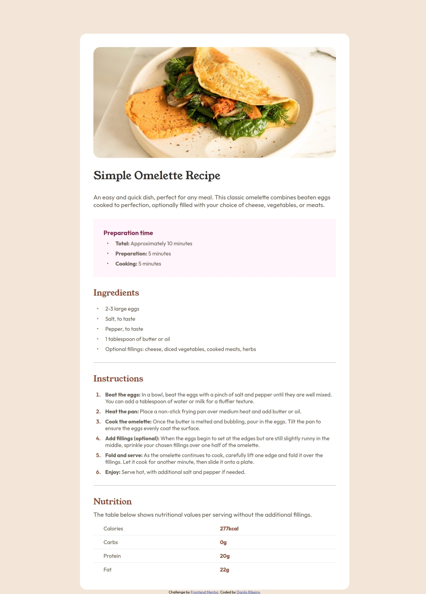

# Frontend Mentor - Recipe page solution

This is a solution to the [Recipe page challenge on Frontend Mentor](https://www.frontendmentor.io/challenges/recipe-page-KiTsR8QQKm). Frontend Mentor challenges help you improve your coding skills by building realistic projects.

## Table of contents

- [Overview](#overview)
  - [Screenshot](#screenshot)
  - [Links](#links)
- [My process](#my-process)
  - [Built with](#built-with)
- [Author](#author)

## Overview

### Screenshot

### Links

- Live Site URL: [Click here](https://daniloribeiro07.github.io/front_end_mentor/recipe-page/)

## My process

### Built with

- Semantic HTML5 markup
- CSS custom properties
- Flexbox

## Author

- Website - [Danilo Ribeiro](https://daniloribeiro07.github.io/)
- Linkedin - [Danilo Ribeiro](https://www.linkedin.com/in/danilorib/)
- Frontend Mentor - [@DaniloRibeiro07](https://www.frontendmentor.io/profile/DaniloRibeiro07)
